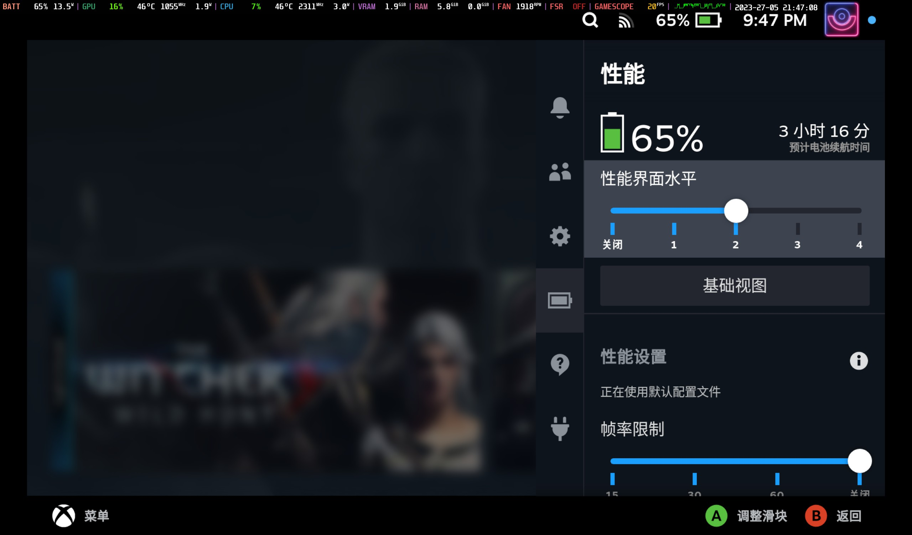
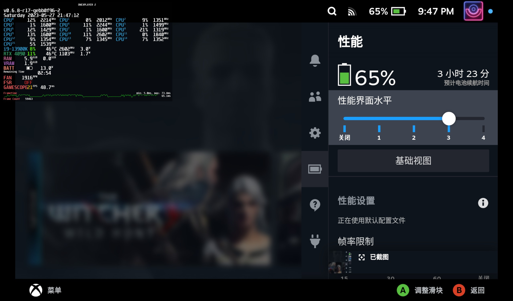

# MangoPeel

[简体中文](README_CN.md) | [English](README.md)

MangoPeel是一款steamdeck插件用于[decky-loader](https://github.com/SteamDeckHomebrew/decky-loader)。它可以让用户配置自己喜欢的mangoapp样式来覆盖steam原有的5档样式。它的工作原理是找到mangoapp的配置文件，通过快捷菜单的UI快速配置各种mangoapp参数写入到配置文件。

## 插件效果截图

## 已知问题
- cpu占用率过高时，可能导致pyinotify的监听失效，此时切换steam样式可能不会替换为自定义的样式，只需在cpu占用率正常时重新切换一次steam样式即可。
- mangoapp的字体比例调整差距过大时，会导致布局间隔出现异常，此为[mangohud](https://github.com/flightlessmango/MangoHud)的bug，等待修复即可。
- 部分参数例如颜色，圆角大小等，在mangohud里面可以实时配置，但是在mangoapp启动后再修改并不会生效，因此目前还未加入到快捷菜单前端中，等待[mangohud](https://github.com/flightlessmango/MangoHud)修复，或者后续有其他方式可以使其生效再加入到配置列表。

## 未来目标

- [x] 自定义文本样式
- [ ] 加入各个颜色修改参数
- [ ] 允许自定义添加参数

## issues
   遇到任何问题，请在[issues](https://github.com/Gawah/MangoPeel/issues)提交